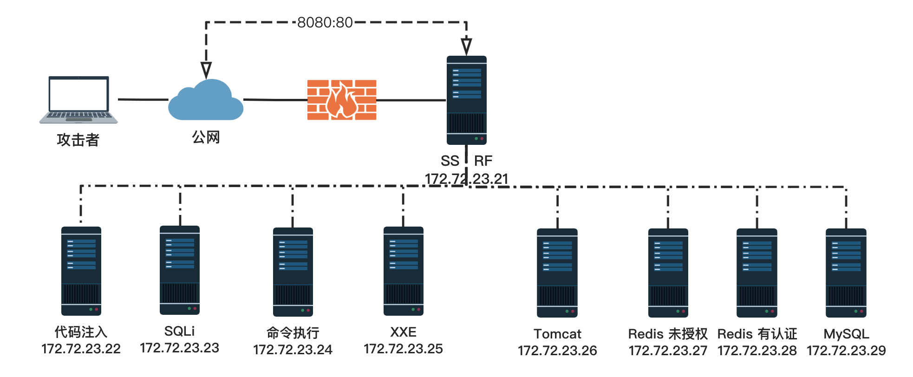

# ssrf-labs
一个ssrf的综合靶场，基于国光师傅的sqlsec/ssrf-vuls，重制了部分关卡，并且添加了完整的dockerfile和dockers-compose。

靶场的设计拓扑图：

  

后续应该还会加两个场景，我看国光师傅还有坑没填，看看这两天能不能帮忙填上ww


## Usage
clone 本项目，然后执行`docker-compose up -d`即可。
```
git clone https://github.com/ProbiusOfficial/ssrf-labs.git
cd ssrf-labs
docker-compose up -d
```
访问8080端口即可看到靶场页面。

## Writeup
对齐国光师傅的靶场 - [手把手带你用 SSRF 打穿内网](https://www.sqlsec.com/2021/05/ssrf.html)，这里也提供了一份writeup，供大家参考:（下次更新一起放上来w）

## 鸣谢

- [国光师傅：手把手带你用 SSRF 打穿内网](https://www.sqlsec.com/2021/05/ssrf.html)
- [Github：sqlsec/ssrf-vuls](https://github.com/sqlsec/ssrf-vuls)
- [Github：tarunkant/Gopherus](https://github.com/tarunkant/Gopherus)
- [Github：LS95/gopher-redis-auth](https://github.com/LS95/gopher-redis-auth)

## 开源许可证

- 本项目基于无许可证的原始仓库：https://github.com/sqlsec/ssrf-vuls
- 所有新增/修改的代码采用 MIT 许可证（详见 LICENSE 文件）
- 使用者需自行承担使用无许可证代码的风险